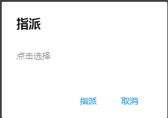

# Modal单据模版
> Modal是一个以Modal的形式显示一张单据的模版

## Modal模版属性
* title 
    + type

        String
    + 描述

        Modal的标题
* actions 
    + type 

        Array(Action)
    + 描述

        Modal的按钮，这里一般会引用表单上的按钮，
* items 

    + type

        Array(ControlRef)
    
    + 描述

        表单上控件的列表，控件的描述方式和TabTemplate中的一致，ControlRef的属性请参考TablTemplate 

## Action

* key
    + type

        String
    + 描述

        这个key是单据上控件的key

* caption
    + type

        String
    + 描述

        控件的标题，如果不设置，则会直接使用设计器中指定的标题
