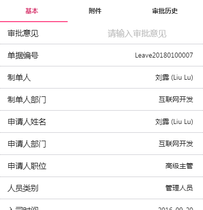
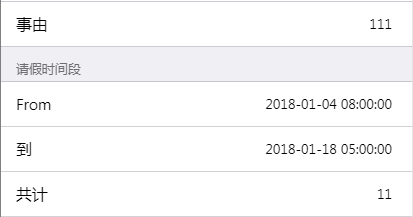

# Tab单据模版
> Tab单据模版是将单据渲染成Tab形式，当前Tab会被渲染在上方，支持拖动，支持动画。

## Tab模版属性
* foot
    + type 

        Element
    + 描述

        页面最底层的显示配置
* tabs

    + type

        Array(Tab)
    
    + 描述

        Tab页描述数组

* controls

    + type

        Object(Key:formKey,Value:Control)

    + 描述

        这个属性用于重新定义控件的属性

* ignoreControls

    + type
    
        Array(String)

    + 描述

        这个属性是一个单据中控件key的列表，用于描述当前单据中不需要渲染的控件。

## Tab页描述
* caption

    + type

        String
    
    + 描述

        Tab也的页头文本
* items

    + type

        String | ControlRef | ControlGroup

    + 描述

        控件数组，会以Cell的形式进行渲染。
    
## ControlRef
* key

    + type

        Stirng

    + 描述

        控件的key

* layoutType

    + type 

        String
    
    + 描述

        控件的布局类型，当前只支持cell和control，所以一般不用指定，默认Cell,如果不需要左边的Label可以设置成control

* visibleRelated
    
    参考ControlGroup中的对应属性
* visibleNotEmpty

    参考ControlGroup中的对应属性
* visibleEqual

    参考ControlGroup中的对应属性

* caption

    + type

        String

    + 描述

        控件的label

## ConrolGroup
>用于渲染一个带头标题的CellList

* caption

    + type

        String
    
    + 描述

        头标题信息
* visibleEqual

    + type 

        {
            "yigoid": String
            "value": any
        }

    + 描述

        用于控制当前ControlGroup的可见性,当yigoid对应的控件的值为Value属性指定的值的时候，则显示，否则隐藏。
* visibleRelate

    + type

        String

    + 描述

        用于控件当前ControlGroup的可见性，当当前值对应的控件可见的时候，则可以见，否则则隐藏，这里可以引用一些Panel类的控件
* visibleNotEmpty

    + type

        String

    + 描述

        用于控制当前ControlGroup的可见性，当当前值对应的控件为空的时候，则隐藏，否则则显示。

* items

    + type

        String | ControlRef 
    
## Element
>用于渲染一个React的控件,由于在配置的json文件中不能直接使用React的控件，所以这里需要做一些转换,这个类型其实是用在描述控件的属性上的，也就是在Control的描述中可以使用Element来描述一个React控件。

* type
    + type 
        
        String
    + 描述

        这里只能是element

* elementType 
    + type

        String
    + 描述

        一个Control的名称
* elementProps
    + type

        Object(key:String,value:Object)
    + 描述

        就是传递给控件的属性

## Control
>描述一个控件，其实和Element差不多，只是在当时最开始做的时候分成了两个概念，就没有再去做合并

* control
    + type

        String
    + 描述

        一个控件名称
    
* 其他属性
    + type

    + 描述

        任何值，以属性的形式传递给control属性指定的控件,这个属性的类型可以是Element

