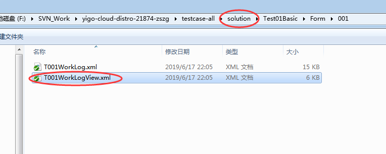
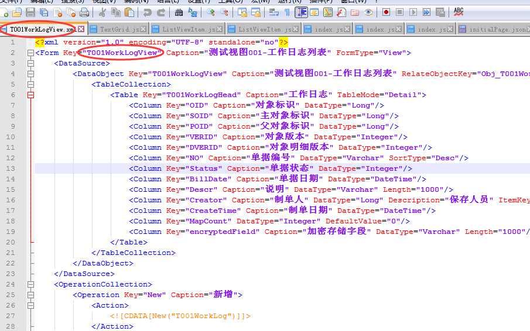
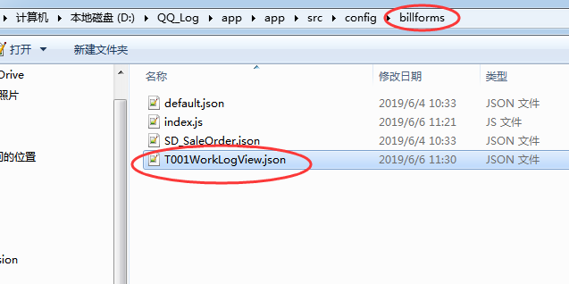

## YIGO2的手机界面开发

### 目录结构
```
src
  +-config
  +-controls
  +-entry
  +-font
  +-controls
  +-FormPara
  +-i18n
  +-img
  +-store
  +-template
```

#### 1 config
##### 1.1 billforms目录
   ###### 1.1.1 用于保存所有的单据配置，这个目录中必须有一个index.js用于导出所有单据配置信息。
   - 1.1.1.1 先要引进单据配置文件
   ```javascript
   import T001WorkLogView from './T001WorkLogView.json';
   ```
   - 1.1.1.2 导出单据配置信息
   ```javascript
   export default {
	  default: defaultForm,
	  ...
	  T001WorkLogView
   };
   ```

   ###### 1.2 单据配置文件的名称必须和设计器中的单据key一致，大小写敏感
   - yigo的solution下的配置文件名
   
   - 查看单据配置的formkey
   
   - 手机界限配置文件名
   
   
##### 1.2 control.js文件
   ###### 1.2.1 与src/controls目录结合
   ###### 1.2.2 用于引入外部实现的控件，这个文件中导出的控件可以以导出的名称在单据配置中使用。
   - 引进控件文件
   ```javascript
   import T001WorkLogView from './T001WorkLogView.json';
   ```
   - 导出可用控件配置
   ```javascript
   export default {
	  default: defaultForm,
	  ...
	  T001WorkLogView
   };
   ```
   - control.json何用
##### 1.3  initialPage.json
   - 首页配置,一般将其指向了`src/controls/home.json`这个自定义控件

##### 1.4  login.json
   - 登录界面配置，这个json只用于默认的登录界面

##### 1.5 project.js
   - 这个文件导出当前项目的一些基本信息，比如服务器地址等等，与这个文件相关的还有两个json文件，project.debug.json和project.json，设计中一个是测试环境的，一个是正式环境的配置信息。
   - 目前最新的git中没有这个文件,是否是遗漏了,还是新的机制？只保留了project.json
   
##### 1.6

#### 2 controls
    按照**开发规范**,这个目录中存放项目中开发的控件,只需要在config/control.js引入即可。结合1.2观看

#### 3 font
   - 3.1 导入iconfont中的字体项目,对于字体没有需求可以忽略
   - 3.2 如何设置？

#### 4 FormPara
   ##### 4.1 有些单据需要一些额外的单据参数，最常用的是单据新增的时候需要提供一个流程ID.
   ##### 4.2 这个结合章节[1.1] 每次添加新的单据配置,需要在`zh-CN.json`或者`en-US.json`添加单据属性单据
   ```javascript
   ...
   "T001WorkLogView": {
      "title": "工作流测试项1",
	  ...
   },
   ...
   ```
#### 5 i18n,用于支持多语种
   ##### 5.1 文件结构应该与FormPara保持一致
   ##### 5.2 一般在`zh-CN`.js或者`en-US.js`中的data变量添加映射关系
   ```javascript
   const data = {
      ...
	  "T001WorkLogViewCaption" : "工作流测试项1"
	  ...
   }
   ```
   
#### 6 patch
   ##### 6.1 用于存放一些对第三方组件的补丁，现在仅包含antd-mobile的样式补丁.

#### 7 store
   存放和系统单据无关的其他数据源，现在这个目录中包含了当前登录用户的代办和撤回任务的数量信息。

#### 8 template
   这个目录导入当前支持的所有模版
	
#### 9 util
   项目中使用到的一些工具函数，一些和天信相关的函数就在这个目录中
	
### 模板
**模版**是一个折中的方案,降低了配置单据的复杂度,同时也降低了配置单据的自由度,每个模版都定义一种单据的显示方式,所有的支持的模版都可以在单据配置中被使用。所有的模版都`template`目录下，每一个模版其实都是一个单据和一个配置文件的组合控件，单据的配置存放在`config/billforms`中，在渲染的时候会根据单据配置中指定的模版类型来确定模版控件。所有的模版都需要提供一个`DynamicBillForm`控件，可以从`DynamicBillForm`继承也可以，将`DynamicBillForm`渲染到模版下，一个模版中必须渲染一个`DynamicBillForm`

#### 1 模版开发流程
* 在tempalte下新增模版目录
* 在模版目录下开发模版控件
    >这里必须要注意，在模版导出文件的最后，需要加入模版的注册代码，需要调用defaultTemplateMapping.reg来进行注册

    ```javascript
    import defaultTemplateMapping from '../defaultTemplateMapping';
    ...
    defaultTemplateMapping.reg('tabs', WrappedTabTemplate);
    ```
* 在src/template/index.js中增加对于新模版控件的引用

#### 2 现有模版

##### 2.1 CustomTemplate

>这个模版提供了直接使用一个控件来作为模版，对于某一些单据需要完全自定义单据的渲染形式则可以使用这个模版，在当前的单据配置中几个列表单据都是使用这个模版来实现的。

```javascript
{
    "formTemplate": "custom",
    "control": "RejectList"
}
```
这个就是使用CustomTemplate来配置的一张单据，RejectList是Control.js中引入的控件。

##### 2.2 DynamicTemplate

>这个模版将直接使用在YIGO设计器中设计的布局来显示单据，当前由于部分控件未完成，导致这个模版无法使用

##### 2.3 ListTemplate

>这个模版是一个试验性质的实现，实现了代办列表，和CustomTemplate差不过，只是把CustomTemplate中的Control实现部分写到了模版中。

##### 2.4 NormalTemplate

>这个模版提供单页的一个CellList展现

##### 2.5 TabTemplate
>这个模版提供了多页的CellList展现

[详细可见 tabtemplate.md](./tabtemplate.md)

##### 2.6 ModalTemplate

>这个模版提供了以Modal形式显示单据

[详细可见 modaltemplate.md](./modaltemplate.md)
	
###  附加知识点
#### 1. 所有在界面中使用`yigo2`的操作.需要依赖`yes-platform`模块

#### 2. `yes-platform`的模块实现是可以替换的,在`src/config/webpack.config.js`中定义了`alias`属性方便切换。默认`yes-platform`的实现为`yes-web`模块
```javascript
    ...
    resolve: {
        extensions: ['.js', '.web.js'],
        alias: {
            'react-native': 'react-native-web',
            'yes-platform': 'yes-web',
             yes: 'yes-intf',
        },
    },
    ...
```

#### 3. 页面的内容切换,使用`History.push()`方法,在使用`History.push('card/***'）`之后的调用过程,可以跟踪`src/route/index.js`,根据部分代码可见

```javascript
const defaultCardRoute = {
    DynamicDetail: {
        screen: withNavigation(DynamicView),
        path: 'YESMOBILE/:metaKey/:id/:status',
    },
    DynamicDetail1: {
        screen: withNavigation(DynamicView),
        path: 'YES/:metaKey/:id/:status',
    },
    Workitem: {
        screen: withNavigation(WorkitemView),
        path: 'WORKITEM/:wid/:onlyOpen/:loadInfo',
    },
    WorkitemM: {
        screen: withNavigation(WorkitemView),
        path: 'WORKITEMM/:wid/:onlyOpen/:loadInfo/:msg',
    },
    WorkitemField: {
        screen: withNavigation(FieldView),
        path: 'WORKITEM/:wid/:field',
    },
};
```
|push路径|对应模板|
| :-------- | :------- |
|`History.push('YESMOBILE/:metaKey/:id/:status'）`|`src/DynamicView.js`|
|`History.push('YES/:metaKey/:id/:status'）`|`src/DynamicView.js`|
|`History.push('WORKITEM/:wid/:onlyOpen/:loadInfo'）`|`src/WorkitemView.js`|
|`History.push('WORKITEMM/:wid/:onlyOpen/:loadInfo/:msg'）`|`src/WorkitemView.js`|
|`History.push('WORKITEM/:wid/:field'）`|`src/FieldView.js`|


#### 4. 针对最常用的`History.push('card/YES/${metaKey}/${id}/${status}')`解说下参数含义
   - metaKey 表单的key，这个就是yigo2的form对象key 
   - id
     - 如果是具体单据就是单据的OID
     - 如果是序时簿或多样式表单,则直接使用-1
     - 如果是单据新增,则直接使用new
   - status 操作状态,如编辑,或者新建,或者载入

#### 5. 登入后的主页展示修改
   - 修改 `src/controls/Home.js`文件中`Home.render()`部分,对于return的json结构就是展示登入后的个人主页展示部分
   - `Home.render()`的返回结果,请按照vue.js的规则去开发编写

#### 6. 如何添加展示yigo2的目标单据
   - `src/controls/Home.js`中,render的·view-body·添加显示以及`History.push('card/YES/${metaKey}/${id}/${status}')`,如:
   ```javascript
    export default class Home extends Component {
        render() {
            return (
                ...
                <View style={styles.view}>
                    <View style={styles.listItem}>
                    <Button onPress={this._onPressButton} title="人员" />
                    </View>
                </View>
                ...
            )
        }     
        _onPressButton(){
            History.push('card/YES/T001WorkLogView/-1/EDIT')
        }
    }
   ```
   - 在`src/config/billforms`中添加以`formkey`为文件名的json文件
   - 在`src/config/billforms/index.js`中添加,`import`依赖，同时在default中添加改formkey,一下是`git diff`的结果
     ```shell
        diff --git a/src/config/billforms/index.js b/src/config/billforms/index.js
        index b5672e8..e28690b 100644
        --- a/src/config/billforms/index.js
        +++ b/src/config/billforms/index.js
        @@ -1,7 +1,9 @@
         import defaultForm from './default.json';
         import SD_SaleOrder from './SD_SaleOrder.json';
        +import T001WorkLogView from './T001WorkLogView.json';

         export default {
             default: defaultForm,
             SD_SaleOrder,
        +    T001WorkLogView,
         };
     ```

   - 在`src/FormPara/zh-CN.json`添加改form的单元
      ```shell
        diff --git a/src/FormPara/zh-CN.json b/src/FormPara/zh-CN.json
        index c42a551..4eddb9a 100644
        --- a/src/FormPara/zh-CN.json
        +++ b/src/FormPara/zh-CN.json
        @@ -4,6 +4,9 @@
                     "WorkflowTypeDtlID": 4361395
                 },
                 "title": "请假单"
        +    },
        +    "T001WorkLogView": {
        +
             },
             "B_TravelExpenseApply": {
                 "title": "差旅(探亲)申请单"
        ...
     ```

#### 7. 在开发时,切换访问的数据提供源,src/config/project.json,这个已在https://github.com/jefferscn/yes-framework/wiki声明,设置好config/project.json中的serverPath属性，指向有效的YIGO的服务地址

#### 8. 如何做打开即登入的动作,参考https://github.com/jefferscn/yes-framework/wiki/认证模块开发

   - 重点1 在`src/config.js`中添加

     ```
     appOptions.authenticatedRoute = WechatSSOAuthenticatedRoute //这个未自定义认证模块
     ```
   - 重点2 在自定义认证模块中,凡是想使用`await`来做到时序性的，必须在方法上修饰为`async`且记得方法前需要`const`来修饰,这些参照ES6准则,
   - 重点3 基于ES6,service模式不在使用ajax,而是使用fetch函数,且开启`credentials`模式,保证后台可以更改`cookie`,如
     ```javascript
      const resp = await fetch(`${Svr.SvrMgr.ServletURL}/../wechat/sso/5`, {credentials: 'include' });
      const result = await resp.json();
     ```

