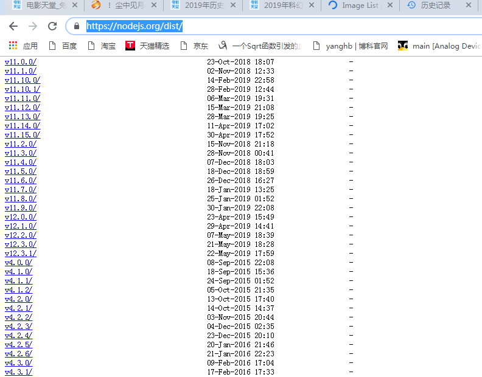
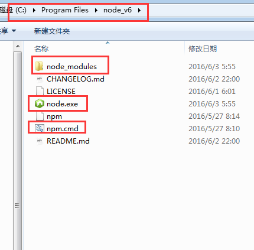
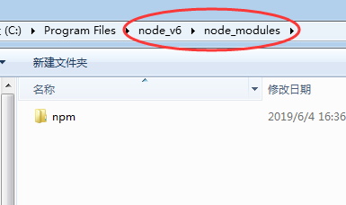
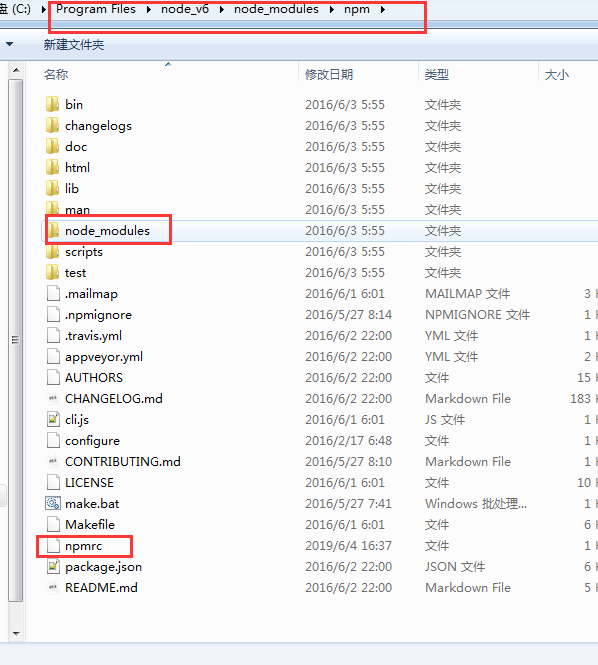
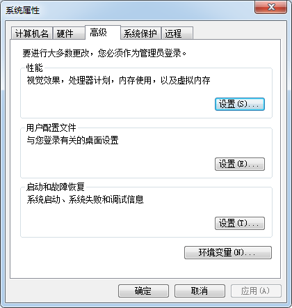
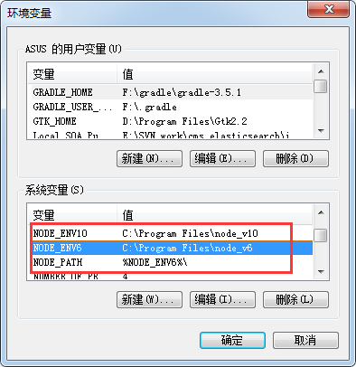
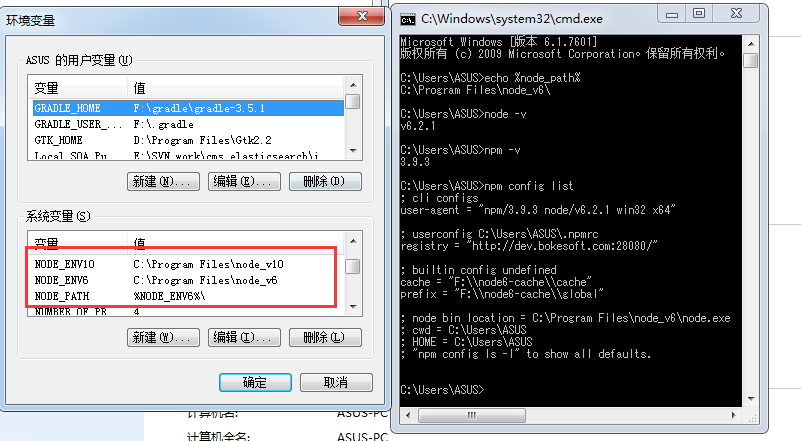
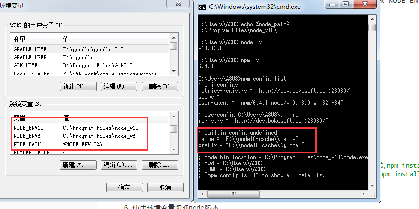
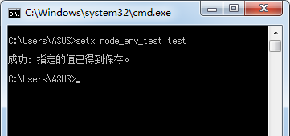
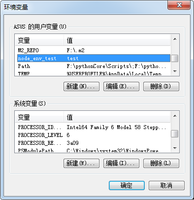

## 如何在一台开发机上多个`node/npm`环境

### 场景描述

​      目前`node`+`npm`+`webpack`开发前端，已成为标配，但是在一些自开发模块组件时,由于模块开发组对于环境升级滞后,导致Node+npm等并非最新环境,但是由于`node_v6`和`node_v10`是个很大架构分水岭。所以对于前端开发来说,需要存在多个Node环境用于开发,且相互不干扰,那么以下操作可以解决这个问题！

#### 1. 如何获取node的历史版本
请访问https://nodejs.org/dist/,可以看见历代node的版本



#### 2. 下载需要的`Node`版本
`windows`建议使用`*.zip`(因为装过一个版本node之后,`*.msi`,无法继续安装),`linux`使用`*.tar.gz`
#### 3. 解压缩
任意路径，如C:\Program Files\node_v6

#### 4. 设置环境变量
设置对应node版本的环境变量,其环境变量的值为对应`node`版本文件的解压路径,如`setx NODE_ENV6=`C:\Program Files\node_v6

#### 5.注意Node文件的结构




- 重点
```java
nodeFile
   +- node_modules
   |    +- npm
   |       +- .npmrc
   |       +- node_modules
   |       +-...
   +- node.exe
   +- npm.cmd
   +- ...
```
如果没有npmrc文件请新建,其内容为
```properties
prefix=F:\node6-cache\global #你指定这个node下,模块下载的缓存地址,global模式,npm install -g
cache=F:\node6-cache\cache  #你指定这个node下,模块下载的缓存地址,cache模式,npm install
```
**注意**,不同的node环境,npmrc.prefix,npmrc.cache必须指向不同的地址,不然仍然会出现安装冲突！

#### 6. 使用环境变量切换node版本

   ##### 6.1 设置多个node版本的环境变量,node_envX1，node_envX2，node_envXN...
   
   

   ##### 6.2 设置一个名为`node_path`的环境变量,其值为当前使用的node版本

   ##### 6.3 对于环境变量`Path`里面,永远使用`node_path`如xxx:%node_path%:xxx

   ##### 6.4 效果
   - 使用nodev6
      
   - 使用nodev10
      

#### 附
   - 如果喜欢在`windows`下用命令行的,可以使用`setx`命令
     
   - 使用效果
     
   - 在`linux`下，请用export替换set就可以了

   

