## YIGO应用代码管理规范-模块合并

### 功能模块独立创建
   - 使用`svn`的`copy-to`功能,复制一份`yigo-srping-boot-maven-template`

### 功能模块合并
   - 当功能模块首次独立开发完成后,应该并入`Yigo-all`的服务应用中,保证`Yigo`平台功能一体化
   - 当功能模块功能更新完成后,应该并入`Yigo-all`的服务应用中,保证`Yigo`平台功能一体化
#### 1 合并操作规范及说明
   - 1.1 首次合并,应该使用`svn-repo`的`copy-to`功能,这样避免多次设置`svn:ignore`,`svn:executable`等`svn`属性
      - 1.1.1 打开`svn-repo`,鼠标右键,选择`TortoiseSVN`菜单,再选择`Repo-browser`菜单
      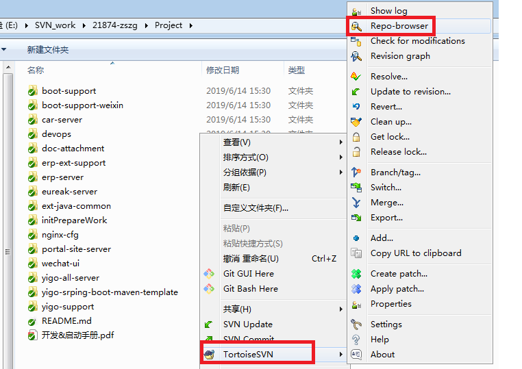
      - 1.1.2 点击`copy to`,鼠标选中合并的模块,右键选择`copy to`菜单
      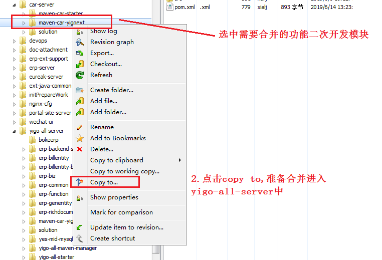
      - 1.1.3 输入目标地址,一般为输入目标地址,https://172.19.20.72/svn/Yigo项目/project/boke-team-develop-yigo-all-server
      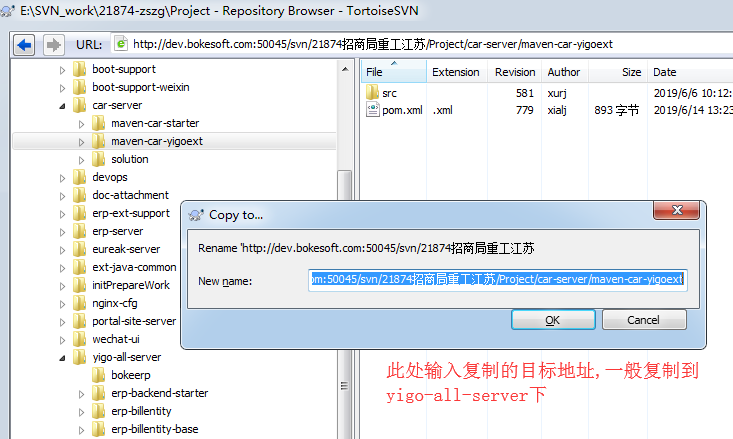
        - **注意**,严禁使用本地的复制粘贴,必须使用svn-copy-to,只有这样以后`merge`会少很多麻烦
   - 1.2 功能更新,使用`TortoiseSVN`-`Merge`功能
      - 1.2.1 在`yigo-all-server`中,选中对应需要被合并的模块,鼠标右键,选择`TortoiseSVN`菜单,再选择`Merge`菜单
      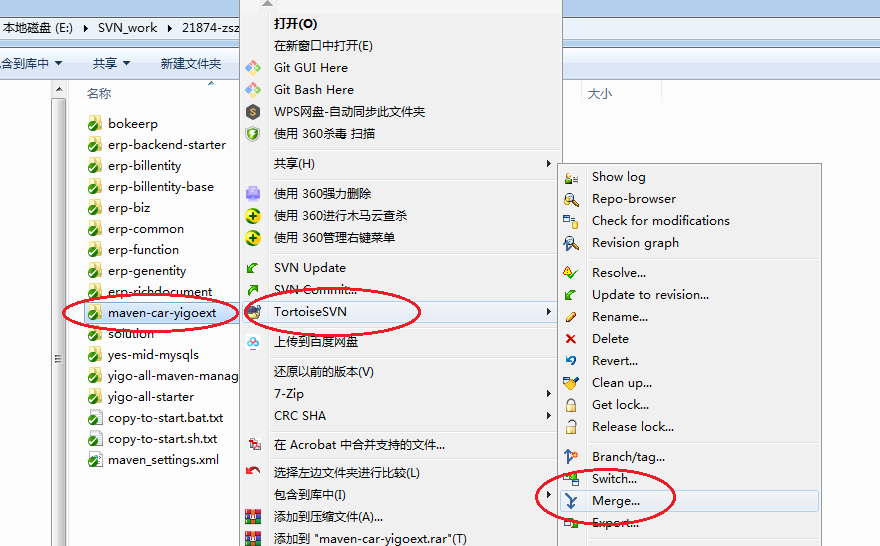
      - 1.2.2 在使用默认选择,点击`next`
      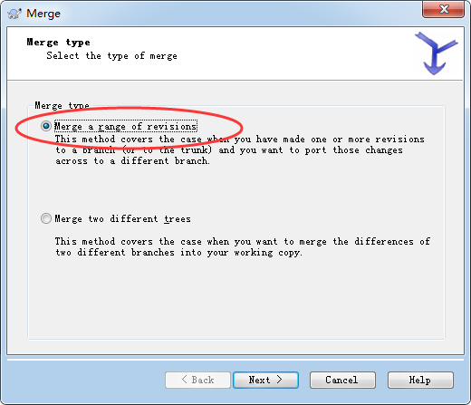
      - 1.2.3 点击地址选择(..),选择开发模块的svn-repo地址
      
      - 1.2.4 点击`showlog`,选择需要合并的版本,并不是最新就OK,而是协商说明那个版本是可以发布的
      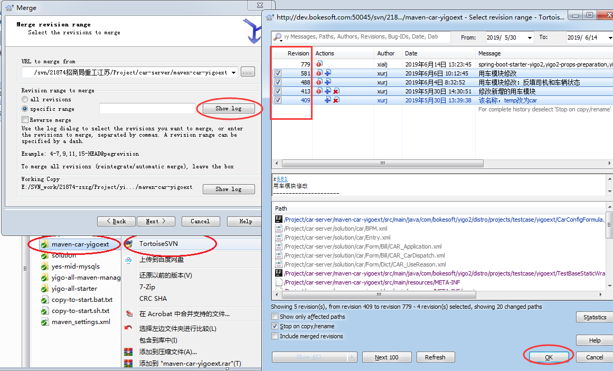
      - 1.2.5 再次确认点击`next`
      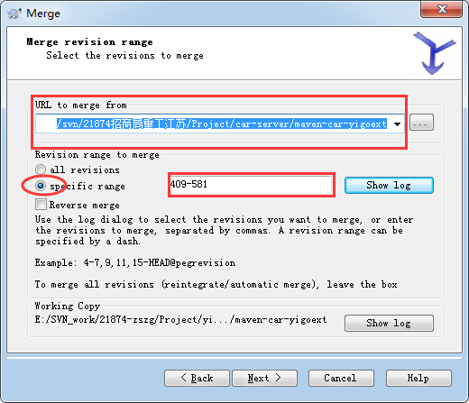
      - 1.2.6 默认选择,点击`merge`
      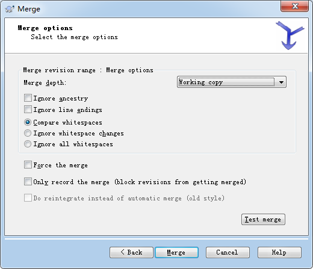
      - 1.2.7 如果发生冲突,一般优先选择`prefer repository`,并先关开发人员查看是否需要在修改
      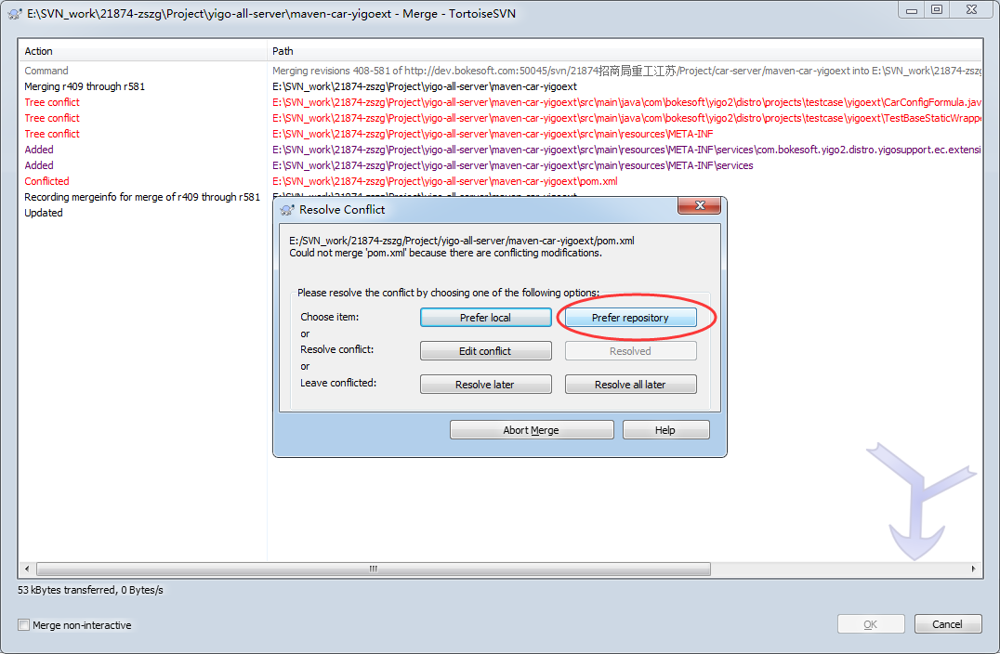
   - 1.3 合并规则
      - 1.3.1 对于二次开发,直接复制或者合并带有pom的模块,从**1.2.1**就可以看出      
      - 1.3.2 对于Yigo配置,只能合并独立开发的config,**禁止**合并整个solution文件夹
      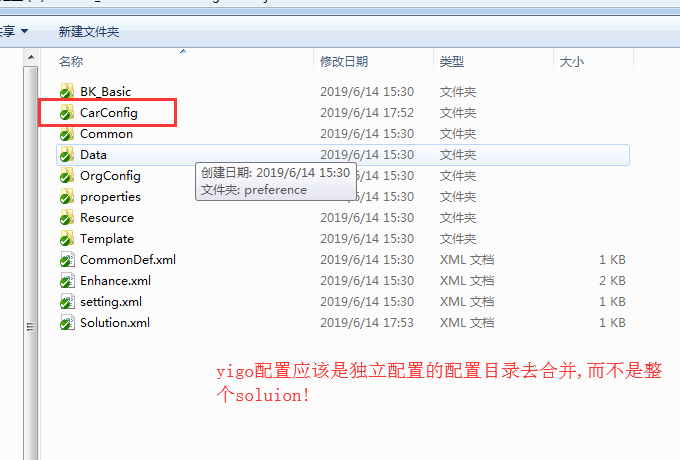
#### 2 合并后记录规范
   - 1.3.1 每次合并必须有份合并日志,告知合并结果,合并日志存放在`Project/yigo-all-server/merge-note`下
   - 1.3.2 合并日志文件名的规则:<模块名>-merge-note-<日期戳>
      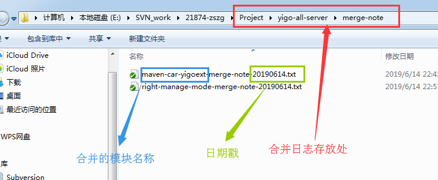
   - 1.3.3 合并日志文件,须记录合并到的svn版本号,虽然通过工具可见,但是有时工具会出问题,留下文件更牢靠
   - 1.3.4 如果合并后,对文件发生再次修改,应在合并日志文件中记录:文件修改了内容
      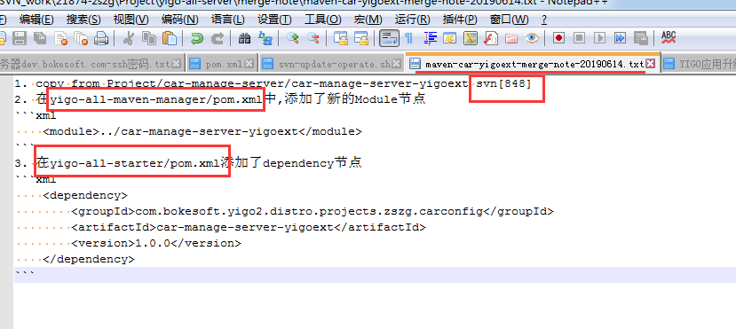