## YIGO应用升级-打包发布/更新规范说明

### 打包发布

http://mirrors.tuna.tsinghua.edu.cn/apache/maven/maven-3/3.6.1/binaries/apache-maven-3.6.1-bin.zip

#### 1 打包
##### 1.1 更新版本
###### 1.1.1 `yigo-all-server/yigo-all-starter/pom.xml`每次功能合并后,发布打包前,应该修改下version版本,使其递增
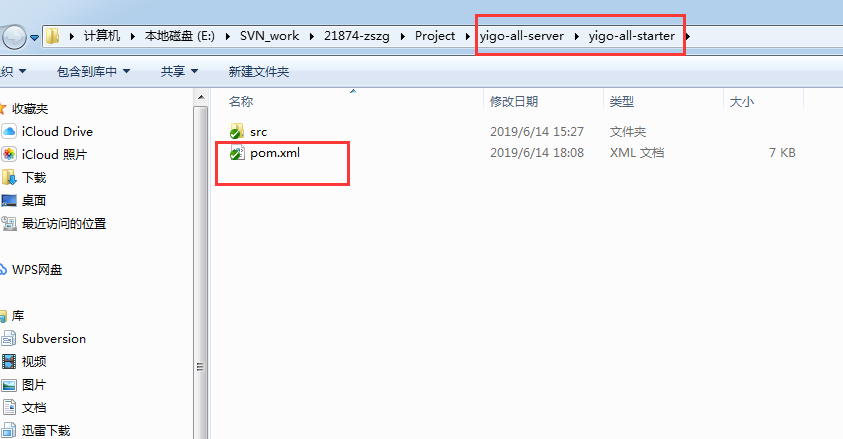
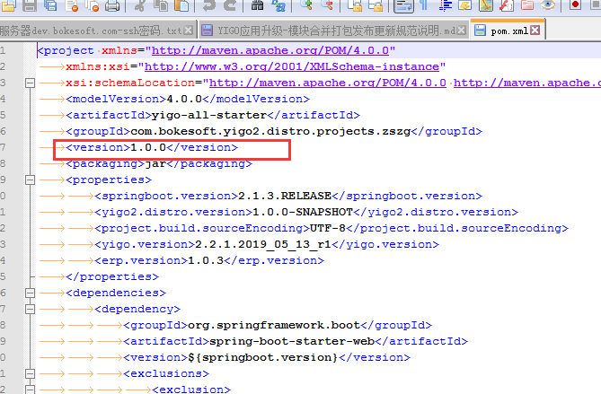
##### 1.2 应用打包
###### 1.2.1 使用一键式打包脚本
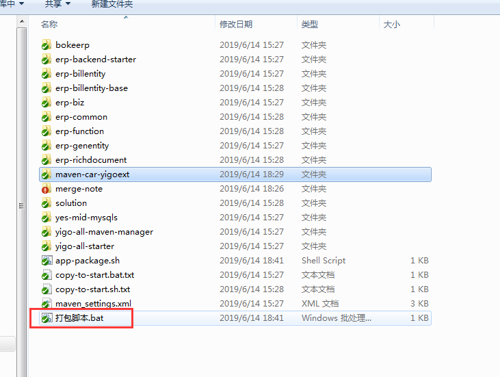
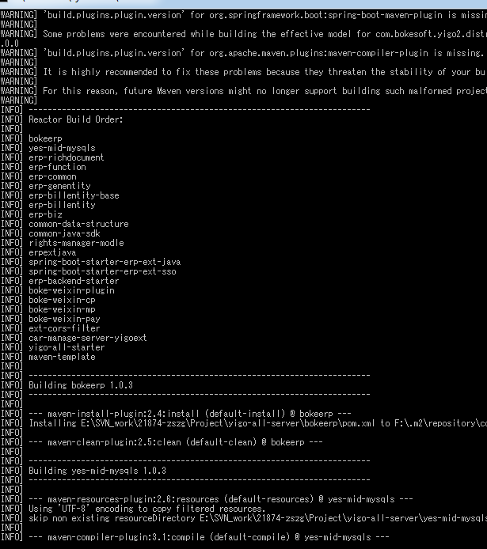
打包**初始验证成功**,可见多少个模块需要打包
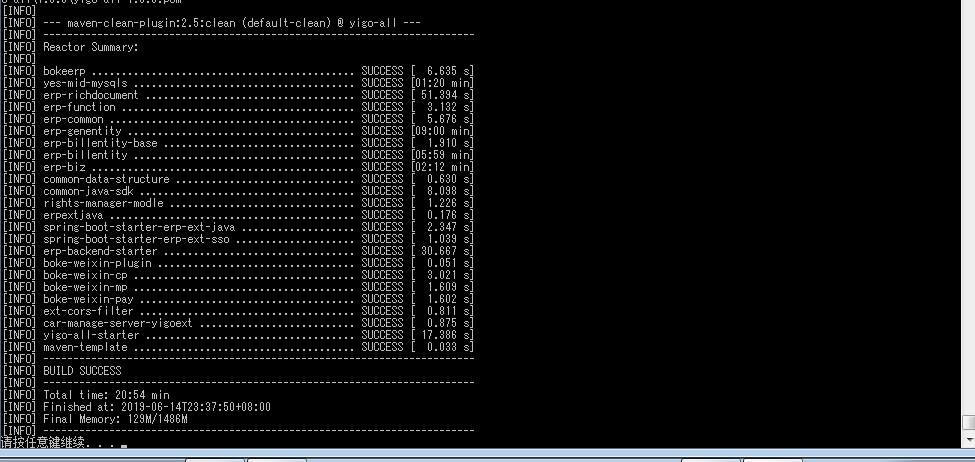
###### 1.2.2 将新生成发布包复制到`release-publish/yigo-all-server/app-server`下
   - **注意**:目前打包脚本,会**自动移植**,但是如果是失败,手工移植的时候,请参照此步骤

   - 发布包生成地址`Project/yigo-all-server/yigo-all-starter/target`
      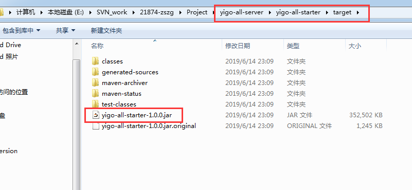
   - 发布包提交地址`release-publish\yigo-all-server\app-server`
      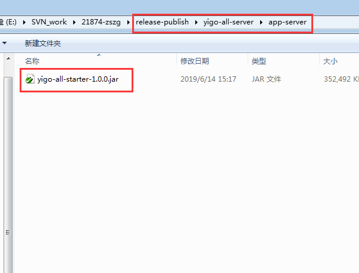
##### 1.3 打包注意事项
###### 1.3.1 如果在发布测试结果发现有问题,重新整合打包时,则不用强制升级版本
###### 1.3.2 一旦发布包提交后并在正常使用一段时间后发现了小bug,在下次打包时也必须升级版本

#### 2. 发布
##### 2.1 提交注意事项
###### 2.1.1 打包前,应该先请开发人员确认模块合并没有问题,并启动测试下
###### 2.1.2 打包后提交前,应该请开发人员,使用发布包,本地测试启动有无异常,确认无误后在提交
###### 2.1.3 提交新的发布包同时,必须删除旧的发布包,在发布分支只会存在一个有效的发布包,如果发生问题,可以通过svn回滚

##### 2.2 发布日志规范
###### 2.2.1 打包发布,必须提交对应版本的打包发布日志,日志存在`release-publish/yigo-all-server/release-note`下
   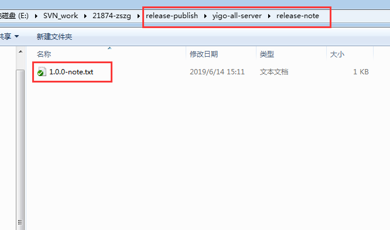
###### 2.2.2 打包发布日志,每次更新发布包,应该记录当前环境下`yigo-all-server`的所在的`svn`版本
###### 2.2.3 打包发布日志,还应该记录更新完成了什么样的需求
   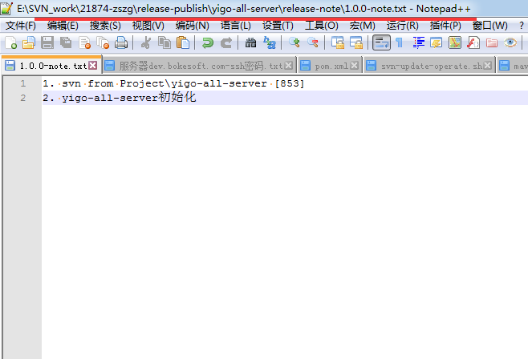

### 应用服务更新
#### 1 如何连上应用服务器
##### 1.1 Windows环境
###### 1.1.1 推荐使用工具`MobaXterm_Personal`,这个在svn中,`release-publish/linux服务器访问工具`目录下有,直接解压缩就可以使用
###### 1.1.2 配置ssh访问连接
   - 点击session创建一个ssh访问连接
      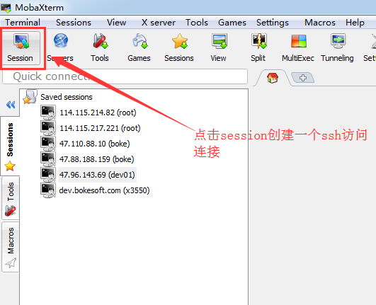
   - 配置ssh连接信息
      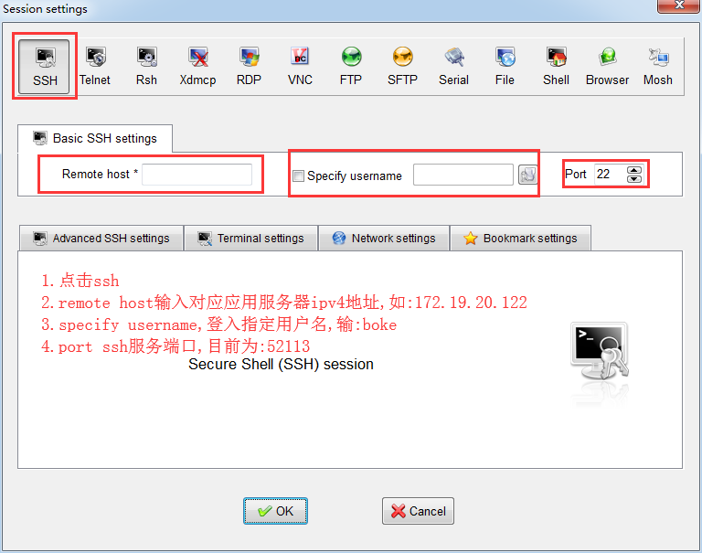
###### 1.1.3 登入服务器
   - 选择入口,进行连接
      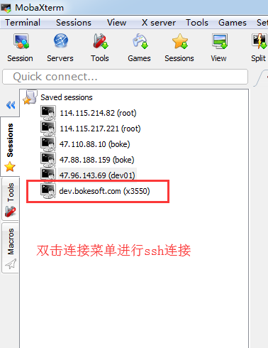
   - 首次连接会需要密码,以后就会自动登入
      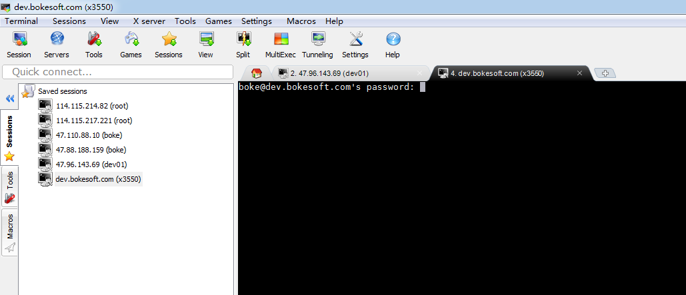
   - ssh成功连接界面
      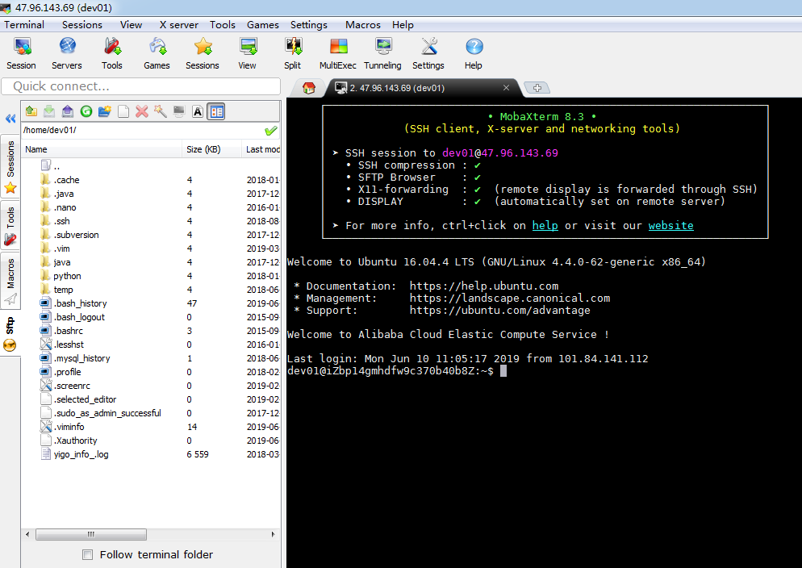

##### 1.2 Linux环境
###### 1.2.1 使用ssh-client，如
```shell
ssh boke@172.19.20.124 -P52113
```
###### 1.2.2 如果ssh命令无效,请先安装ssh
- centos
```shell
yum install -y openssl openssh-server
```
- ubuntu
```shell
apt-get install ssh
```
###### 1.3 具体链接参数,请问项目管理者要


#### 2 执行更新
###### 2.1 运行一键更新脚本
```shell
~/yigoupdate.sh
```