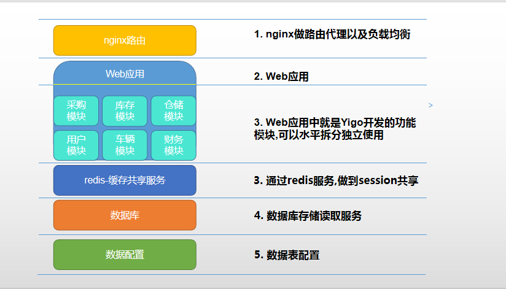
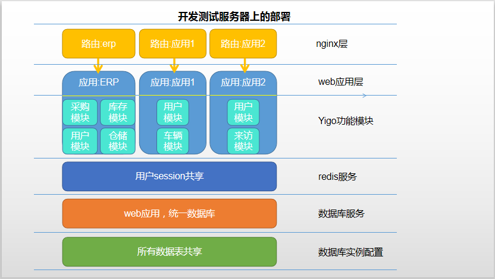
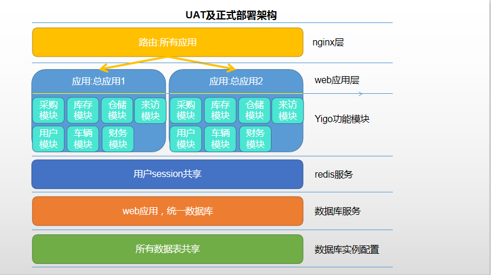
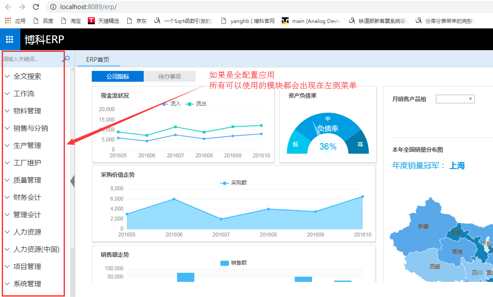

## 应用部署设计
#### 1.软件结构说明

- 如图所示
1.  用户访问到nginx所在的服务器,由nginx发起反向代理,是用户接触到具体的`spring-boot-web`应用
2.  YIGO的`spring-boot-web`应用里面是由多个功能模块组合而成,对应用户使用业务
3.  redis层，使得负载均衡时,用户会话(session)可以共享,提高应用服务性能,另外字典缓存也在redis缓存中
4.  数据库提高数据读取写入服务
5.  数据配置,目前单库单实例

#### 2.yigo平台开发测试部署说明

- 如图所示
1. 根据应用的业务,可以将yigo功能模块做拆分或者合并,使其部署更具灵活性
2. 不同应用,在基础数据,如用户数据相同的情况下,可以同redis缓存,使其保证用户会话(session)**一致性**
3. 鉴于yigo模块拆分与合并的**便利性**,所以对于明确范围的应用,可以先**独立**开发及测试

#### 3.uat及正式部署设计说明

- 如图所示
1. 在开发测试通过后,应该将功能模块整合进来,作为**一体化**应用来启动
2. 基于了**一体化**模式,所以用户只需要知道**1个**访问路径即可
3. 基于一体化,所有用户的操作入口可以**统一管理**
   