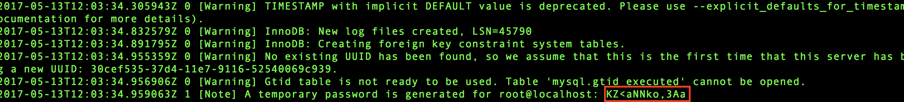

## 环境部署操作说明

#### 1.数据服务器环境的部署
   ##### 1.1 用户准备
   ###### 1.1.1 请在用户root的环境下，可以使用下面的命令,进入root角色
   ```shell
        sudo su -
   ```
        这个命令输入后,会需求当前用户的密码,输入即可
   ###### 1.1.2 创建一个数据服务的用户,`mysql`
   ```shell
        useradd mysql;
   ```
   ###### 1.1.3 添加运维用户包含了运维组
   ```shell
        useradd mysql;
   ```
   ###### 1.1.4 将`mysql`用户扔到运维组
   ```shell
        gpasswd -a mysql devops;
   ```
   ###### 1.1.5 创建一个运维目录，并赋权给运维组
   ```shell
        mkdir -pv /data/devops;
        chown devops:devops -R /data/devops;
   ```
   ##### 1.2 mysql的安装
   ###### 1.2.1 请在用户root的环境下，可以使用下面的命令,进入root角色
   ```shell
        sudo su -
   ```
        这个命令输入后,会需求当前用户的密码,输入即可

   ###### 1.2.2 准备mysql数据的存放地址
   ```shell
        mkdir -pv /data/mysqldata;
        chown mysql:mysql -R /data/mysqldata;
   ```
   ###### 1.2.3 到`/usr/lib`下,下载并解压mysql5.5安装包
   ```shell
        cd /usr/lib
        wget https://dev.bokesoft.com/public/ecomm/downloads/mysql-5.5.53-linux2.6-x86_64.tar.gz;
        tar -zxvf ./mysql-5.5.53-linux2.6-x86_64.tar.gz;
        rm -rf ./mysql-5.5.53-linux2.6-x86_64.tar.gz
   ```
   ###### 1.2.4 准备mysql的服务初始化
   ```shell
        cd ./mysql-5.5.53-linux2.6-x86_64/scripts/;
        ./mysql_install_db --user=mysql --basedir=/home/mysql/mysql-5.5.53-linux2.6-x86_64 --datadir=/data/mysqldata;
   ```
      - **注意**，这个命令在运行结束的末尾处,会显示root用户的随机登入密码，请记录下来
        

   ###### 1.2.5 准备mysql服务的配置文件
   ```shell
        cp my-default.cnf /etc/my.cnf;
   ```

   ###### 1.2.6 准备mysql服务的启动脚本
   ```shell
        cp mysql.server /etc/init.d/mysql;
   ```

   ###### 1.2.7 修改mysql服务的启动脚本
   ```shell
        vim /etc/init.d/mysql;
   ```

   ###### 1.2.8 修改文件中的两个变量值,是basedir指向mysql服务的所在地址,datadir指向前面预览的数据存放地址
   ```shell
        basedir=/home/mysql/mysql-5.5.53-linux2.6-x86_64
        datadir=/data/mysqldata
   ```

   ###### 1.2.9 保存修改并推出
   ```shell
        #按下ESC键
        :wq
        #并回车
   ```

   ###### 1.2.10 添加mysql操作命令地址,编辑`/etc/profile`文件
   ```shell
        vim /etc/profile
   ```

   ###### 1.2.11 在文件末尾添加如下内容
   ```shell
        export MYSQL_HOME="/software/mysql-5.6.21"
        export PATH="$PATH:$MYSQL_HOME/bin"
   ```

   ###### 1.2.12 保存修改并推出
   ```shell
        #按下ESC键
        :wq
        #并回车
   ```
      - **附**:以上文件编辑使用了`linux`-`vim`操作,如有不懂请自行百度学习

   ##### 1.3 mysql的启用
   ###### 1.3.1 启动mysql-server，并设置启动启动
   ```shell
      systemctl  enable mysqld
      systemctl  start mysqld
   ```
   ###### 1.3.2 登入mysql
   ```shell
      mysql -u root -p
   ```
      输入1.1.4mysql初始化时生成的root随机密码
   ###### 1.3.3 登入mysql后,修改root密码
   ```sql      
      alter user 'root'@'localhost' identified by 'root'; #root为你想定义的密码,请牢记
      #刷新权限
      flush privileges;
   ```
   ###### 1.3.4 登入mysql后,创建一个应用的数据用户zszg,并赋权
   ```sql
      CREATE USER 'zszg'@'%' IDENTIFIED BY 'zszg111' #zszg111,为mysql用户zszg的登入密码   
      GRANT ALL PRIVILEGES ON *.* TO 'zszg'@'%';
      #刷新权限
      flush privileges;   
   ```
   ###### 1.3.5 登入mysql后,准备一个数据库实例给应用
   ```sql
      CREATE SCHEMA `yigo2erp` DEFAULT CHARACTER SET utf8 COLLATE utf8_general_ci;
   ```

#### 2.多媒体存放及缓存服务器的部署
   ##### 2.1 用户准备
   ###### 2.1.1 请在用户root的环境下，可以使用下面的命令,进入root角色
   ```shell
      sudo su -    
   ```
         - 这个命令输入后,会需求当前用户的密码,输入即可
   ###### 2.1.2 添加运维用户包含了运维组
   ```shell
      useradd mysql;
   ```
   ###### 2.1.3 将boke用户扔到运维组
   ```shell
      gpasswd -a boke devops;
   ```
   ###### 2.1.4 创建一个运维目录，并赋权给运维组
   ```shell
      mkdir -pv /data/devops;
      chown devops:devops -R /data/devops;
   ```
   ##### 2.2 svn的安装
   ###### 2.2.1 添加svn1.9的安装源
   ```shell
      yum-config-manager --add-repo=http://opensource.wandisco.com/centos/7/svn-1.9/RPMS/;
   ```
   ###### 2.2.2 修改新添加的repo文件
   ```shell
      vi /etc/yum.repos.d/opensource.wandisco.com_centos_7_svn-1.9_RPMS_.repo
   ```
   ###### 2.2.3 在文件末尾添加`gpgcheck`属性,改为0,使其可用
   ```shell
      gpgcheck=0
   ```
   ###### 2.2.4 保存编辑并推出
   ```shell
      #按下ESC键
      :wq
      #并回车
   ```
   ###### 2.2.5 整个文件内容如下
   ```shell
      name=added from: http://opensource.wandisco.com/centos/7/svn-1.9/RPMS/
      baseurl=http://opensource.wandisco.com/centos/7/svn-1.9/RPMS/
      enabled=1
      gpgcheck=0
   ```
      - 使用获取安装资源
   ```shell
      yum makecache;
   ```
      - 安装svn
   ```shell
      yum install subversion;
   ```
   ##### 2.3 redis的安装和启动
   ###### 2.3.1 请在用户root的环境下，可以使用下面的命令,进入root角色
   ```shell
        sudo su -
   ```
        这个命令输入后,会需求当前用户的密码,输入即可
   ###### 2.3.2 下载并解压
   ```shell
      #准备下载在/usr/lib下
      cd /usr/lib64/
      #下载redis服务
      wget http://download.redis.io/releases/redis-5.0.5.tar.gz;
      #解压
      tar -zxvf redis-5.0.5.tar.gz;
      rm redis-5.0.5.tar.gz;
   ```
   ###### 2.3.3 安装
   ```shell
      cd /usr/lib/redis-5.0.5/;
      make;
   ```
   ###### 2.3.4 将redis相关命令输出到`/usr/local/bin`下,变得可用
   ```shell
      ln -s /usr/lib/redis-5.0.5/src/redis-* /usr/local/bin/;
   ```
   ###### 2.3.5 准备redis的启动配置
   ```shell
      cp redis.conf /etc/redis_6379.conf;
   ```
   ###### 2.3.6 修改redis服务配置参数
   ```shell
      vi /etc/redis_6379.conf;
   ```
   ###### 2.3.7 修改参数如下
        - 将bind 追加172.19.20.127
        - 将databases 16 改为 databases 999
        - 将daemonize 设为 yes
        - 将dir 设为 /data/data/devops/redis-data
   ###### 2.3.8.1 启动redis服务-模式1
   ```shell
      nohup redis-server /etc/redis_6379.conf &
   ```
   ###### 2.3.8.2 启动redis服务-模式2,使用运维脚本,`redis-server-controll.sh`
   ```shell
      ./redis-server-controll.sh start
   ```
        - 以上只是简单的说明,具体可以在本文-运维章节去看
   ##### 2.4 nfs-server的安装和启动
   ###### 2.4.1 请在用户root的环境下，可以使用下面的命令,进入root角色
   ```shell
        sudo su -
   ```
        这个命令输入后,会需求当前用户的密码,输入即可
   ###### 2.4.2 安装nfs-server等相应软件
   ```shell
      yum  install  nfs-utils  rpcbind;
   ```
   ###### 2.4.3 准备共享目录
   ```shell
      mkdir /data/sharedata;
   ```
   ###### 2.4.4 配置nfs-server服务
   ```shell
      vim  /etc/exports;
   ```
   ###### 2.4.5 添加内容
   ```shell
      /data/sharedata 172.19.20.*(rw,sync,no_root_squash)   
   ```
   ###### 2.4.6 保存编辑并推出
   ```shell
      #按下ESC键
      :wq
      #并回车
   ```
   ###### 2.4.7 将共享内容固化导出
   ```shell
      exportfs -a;
   ```
   ###### 2.4.7.1 如果存在`SELinux=enforcing`为情况,需要设置安全过滤
   ```shell
      semanage fcontext -a -t httpd_use_nfs " /data/sharedata(/.*)?"
      restorecon -R -v /data/sharedata 
   ```
   ###### 2.4.8 定义nfs，rpcbind开机启动,并立即启动
   ```shell
      chkconfig nfs on;
      chkconfig rpcbind on;
      systemctl enable nfs.service;
      systemctl enable nfs.service;
      systemctl start nfs.service;
      systemctl start rpcbind;
   ```
   ##### 2.5 mysql的安装,参考 章节[1.2 mysql的安装],为了mysql的数据备份使用

#### 3.nginx的路由配置
   ##### 3.1 nginx的安装
   ###### 3.1.1 请在用户`root`的环境下，可以使用下面的命令,进入`root`角色
   ```shell
    sudo su -
   ```
        这个命令输入后,会需求当前用户的密码,输入即可
   ###### 3.1.2 添加`nginx`安装源
   ```shell
      yum-config-manager --add-repo=http://nginx.org/packages/centos/7/x86_64
   ```
   ###### 3.1.3 修改`/etc/yum.repos.d/nginx.org_packages_centos_7_.repo`文件,使其通过验证
   ```shell
   vi /etc/yum.repos.d/nginx.org_packages_centos_7_.repo
   ```
   ###### 3.1.4 修改内容为,在文件末尾添加下列内容
   ```shell
   gpgcheck=0
   ```
   ###### 3.1.5 保存编辑并推出
   ```shell
      #按下ESC键
      :wq
      #并回车
   ```
   ###### 3.1.6 获取安装源
   ```shell
      yum mackcache
   ```
   ###### 3.1.7 安装nginx
   ```shell
      yum install nginx
   ```
   ##### 3.2 nginx的配置
   ###### 3.2.1 在`/etc/nginx/conf.d`添加一个erp系统的路由配置
   ```shell
   vi /etc/nginx/conf.d/spring-boot-erp-demo.conf
   ```
   ###### 3.2.2 其内容为:
   ```shell
    upstream yigo_server {
        server 172.19.20.124:8089;
        server 172.19.20.125:8089;
        keepalive 1024;
    }

    server {
        listen 8089 default_server;
        location /erp {
                proxy_read_timeout 120s;
                proxy_pass http://yigo_server/yigo;
                proxy_set_header Host $Host:$server_port;
                proxy_set_header X-Real-Ip $remote_addr;
                proxy_cookie_path  /yigo/ /;
        }
    }
   ```
   ###### 3.2.3 保存编辑并推出
   ```shell
      #按下ESC键
      :wq
      #并回车
   ```
   ##### 3.3 nginx的启动
   ###### 3.3.1 设置nginx自动启动
   ```shell
   systemctl enable nginx
   ```
   ###### 3.3.2 启动nginx
   ```shell
   systemctl start nginx
   ```